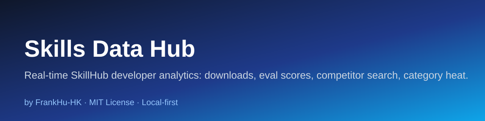

<div align="center">
  
  <h1>Skills Data Hub</h1>
  <p><b>Real-time SkillHub developer analytics dashboard</b> — downloads, eval scores, competitor search, and category heat, unified on a ~50-second refresh.</p>
</div>

<p align="center">
  <a href="https://github.com/FrankHu-HK/skills-data-hub/stargazers"></a>
  <a href="https://github.com/FrankHu-HK/skills-data-hub/network/members"></a>
  <a href="https://github.com/FrankHu-HK/skills-data-hub/issues"></a>
  <a href="https://github.com/FrankHu-HK/skills-data-hub/blob/master/LICENSE"></a>
  <a href="https://img.shields.io/github/last-commit/FrankHu-HK/skills-data-hub?style=flat-square"></a>
  <a href="https://github.com/sponsors/FrankHu-HK"></a>
</p>

<p align="center">
  
  
  
</p>

<p align="center">
  English
</p>

---

## What is Skills Data Hub?

A real-time **decision center for SkillHub creators**. It unifies ~50-second polling of downloads, favorites, eval scores, market data, and category heat — plus full-platform competitor search and blue-ocean / red-ocean strategy hints — into one board you can leave open on a second monitor (PC or tablet, over the same Wi-Fi).

## Why Skills Data Hub?

### The problem

- Shipping a skill is half the job; **knowing how it performs** is the other half.
- SkillHub numbers are scattered and easy to misread.
- Competitor moves and category trends are invisible without constant manual checking.

### Core approach: one unified board

Enter your SkillHub user ID once; the dashboard keeps itself fresh and turns raw numbers into **what to build next** and **what to iterate**.

## Features

- **Unified ~50s live refresh** — downloads, favorites, eval scores, version time, eval-report time, market data, and category heat polled together.
- **Full-platform competitor search** — keyword match across **name + description** with core-term / exclude-term dual filtering. Dual ranking: **Top-10 by downloads** and **Top-10 newest uploads**.
- **Category heat ranking** — blue-ocean vs. red-ocean identification with suggested directions.
- **Version ↔ eval loop** — every card shows `vX released N days ago → eval Y score`, so you can verify whether an iteration moved the needle.
- **Day-over-day growth** — yesterday's day-over-day delta computed per metric.
- **Polished UX** — page-turn number animations, dark tech-style UI, cross-device real-time display.
- **Zero-config detection** — auto-detects your skills; optional `config.json` overrides, no code changes.

## Quick Start

### Prerequisites

- Python 3.10+ (for the bundled server) **or** just open the static dashboard in a browser.
- A SkillHub user ID.

### Run

```bash
# Option A: static dashboard (no server)
open dashboard.html

# Option B: local server with live refresh
python server.py
# then visit the printed local URL
```

Enter your SkillHub user ID in the UI; the board starts polling.

## Development

`server.py` serves the dashboard; `config.json` holds optional overrides; `chart.umd.min.js` is the charting dependency. See [CONTRIBUTING.md](CONTRIBUTING.md) before changing the refresh or ranking logic.

## Roadmap

See [ROADMAP.md](ROADMAP.md).

## Contributing

See [CONTRIBUTING.md](CONTRIBUTING.md). New ranking signals and clearer strategy hints are welcome.

<a href="https://github.com/FrankHu-HK/skills-data-hub/graphs/contributors">
  
</a>

## 💖 Sponsor

If the dashboard helps you ship a better skill or spot a blue ocean, consider sponsoring its development. Sponsorship keeps it **free and continuously improved**.

[](https://github.com/sponsors/FrankHu-HK)

## License

[MIT](LICENSE) — Copyright 2026 Frank Hu (Hu Jingkun).
